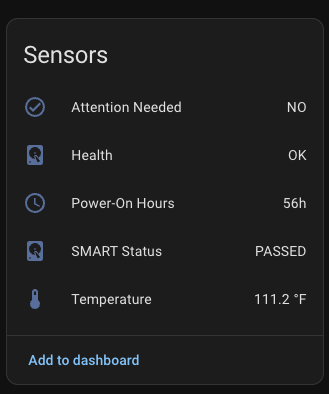
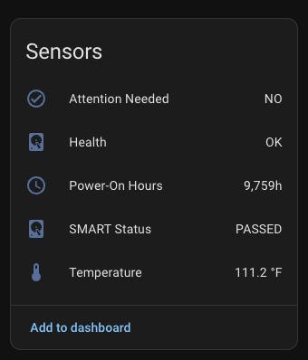
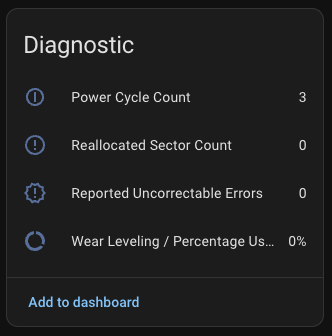
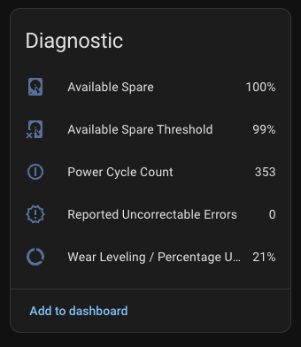

<p align="center">
  
</p>

<p align="center">
  <strong>Monitor disk SMART health across all your machines — right from Home Assistant.</strong>
</p>

<p align="center">
  <a href="https://github.com/DAB-LABS/smart-sniffer/releases/latest"></a>
  <a href="https://github.com/DAB-LABS/smart-sniffer/actions/workflows/release.yml"></a>
  <a href="LICENSE"></a>
</p>

---

SMART Sniffer is a two-part system for Home Assistant: a lightweight **Go agent** that reads SMART data via `smartctl` and exposes it over HTTP, and a **HACS-compatible custom integration** that turns that data into HA devices, sensors, and proactive health alerts.

Most SMART tools only show you the pass/fail verdict — a *lagging* indicator. Drives can report "PASSED" right up until catastrophic failure. SMART Sniffer watches the individual attributes that [research shows](https://www.backblaze.com/b2/hard-drive-test-data.html) actually predict failure, and tells you *before* it's too late.

## How It Works

Install the agent on each machine you want to monitor. Add each agent as a device in HA. Every drive appears as its own device with full sensor entities. Optional bearer token auth secures the connection.

<p align="center">
  
</p>

## Screenshots

<table>
  <tr>
    <td align="center"><strong>Samsung SSD — Sensors</strong></td>
    <td align="center"><strong>Apple NVMe — Sensors</strong></td>
    <td align="center"><strong>USB Drive — Unsupported</strong></td>
  </tr>
  <tr>
    <td></td>
    <td></td>
    <td></td>
  </tr>
  <tr>
    <td align="center"><strong>Samsung SSD — Diagnostics</strong></td>
    <td align="center"><strong>Apple NVMe — Diagnostics</strong></td>
    <td></td>
  </tr>
  <tr>
    <td></td>
    <td></td>
    <td></td>
  </tr>
</table>

## Entities Per Drive

Each drive discovered by the agent gets its own HA device with these entities:

**Sensors:**

| Entity | Description |
|--------|-------------|
| Attention Needed | Proactive health alert — `NO` / `MAYBE` / `YES` / `UNSUPPORTED` |
| Health | SMART pass/fail binary sensor — OK, Problem, or Unknown |
| Temperature | Current drive temp (°C) |
| Power-On Hours | Total hours powered on |
| SMART Status | Raw SMART verdict (PASSED / FAILED) |

**Diagnostic sensors** (created only if the drive reports them):

| Entity | Description |
|--------|-------------|
| Reallocated Sector Count | Bad sectors remapped to spares (ATA) |
| Reported Uncorrectable Errors | Unrecoverable read/write errors (ATA) |
| Wear Leveling / Percentage Used | SSD endurance indicator |
| Power Cycle Count | Total power on/off cycles |
| Reallocated Event Count | Individual reallocation events (ATA) |
| Spin Retry Count | Motor spin-up retries — HDD only |
| Command Timeout | Internal command timeouts |
| Available Spare | NVMe reserve block pool (%) |
| Available Spare Threshold | Manufacturer-set minimum spare (%) |
| Current Pending Sector Count | Sectors waiting for reallocation (ATA, if supported) |

## Attention Needed — Early Warning System

The **Attention Needed** sensor is the centerpiece. It evaluates individual SMART attributes every poll cycle and classifies the drive into one of four states:

| State | Icon | Meaning |
|-------|------|---------|
| **NO** | ✅ | All clear. No action needed. |
| **MAYBE** | ⚠️ | Early degradation signals. Monitor closely. |
| **YES** | 🔴 | Data at risk. **Back up immediately.** |
| **UNSUPPORTED** | ❓ | No SMART data available (common with USB enclosures). |

When a drive's state changes, the integration automatically fires **persistent notifications** in HA — no automations or blueprints required. Notifications escalate, de-escalate, and auto-dismiss as conditions change.

See [docs/attention-severity-logic.md](docs/attention-severity-logic.md) for the full classification rules and notification behavior.

## Quick Install — Agent

### One-liner (Linux / macOS)

```bash
curl -sSL https://raw.githubusercontent.com/DAB-LABS/smart-sniffer/main/install.sh | sudo bash
```

### One-liner (Windows PowerShell as Admin)

```powershell
irm https://raw.githubusercontent.com/DAB-LABS/smart-sniffer/main/install.ps1 | iex
```

### Pin a specific version

```bash
VERSION=0.1.0 curl -sSL https://raw.githubusercontent.com/DAB-LABS/smart-sniffer/main/install.sh | sudo bash
```

The installer detects your OS and architecture, downloads the correct binary from [GitHub Releases](https://github.com/DAB-LABS/smart-sniffer/releases), verifies the SHA256 checksum, installs `smartmontools` if missing, prompts for configuration, and sets up a system service.

### Manual Install

Download the binary for your platform from the [Releases](https://github.com/DAB-LABS/smart-sniffer/releases) page, then:

```bash
sudo cp smartha-agent-linux-amd64 /usr/local/bin/smartha-agent
sudo chmod +x /usr/local/bin/smartha-agent
sudo mkdir -p /etc/smartha-agent
sudo cp config.yaml.example /etc/smartha-agent/config.yaml
sudo smartha-agent
```

### Configuration

Create `config.yaml` in the working directory or `/etc/smartha-agent/`:

```yaml
port: 9099
token: "your-secret-token"    # optional — omit to disable auth
scan_interval: 60s
```

All options can also be set via CLI flags: `--port`, `--token`, `--scan-interval`.

### Service Management

**Linux (systemd):**
```bash
systemctl status smartha-agent
journalctl -u smartha-agent -f
systemctl restart smartha-agent
```

**macOS (launchd):**
```bash
sudo launchctl kickstart -k system/com.dablabs.smartha-agent
tail -f /var/log/smartha-agent.log
```

**Windows:**
```powershell
Get-Service SmartHA-Agent
Restart-Service SmartHA-Agent
```

## Install — HA Integration

### HACS (Recommended)

1. Add this repository as a [custom repository in HACS](https://hacs.xyz/docs/faq/custom_repositories): `https://github.com/DAB-LABS/smart-sniffer` → Category: **Integration**
2. Search for "SMART Sniffer" and install
3. Restart Home Assistant

### Manual

Copy `integration/custom_components/smart_sniffer/` into your HA `custom_components/` directory and restart.

### Adding a Host

**Settings → Devices & Services → Add Integration → SMART Sniffer**

Enter the agent's host, port, optional bearer token, and polling interval. Each drive detected by the agent appears as a separate HA device.

Settings can be changed later without removing the integration — go to the integration's options.

## Building from Source

### Agent (Go 1.22+)

```bash
cd agent
make              # build for current platform
make all          # cross-compile all targets
make release      # build all + generate SHA256 checksums
make clean        # remove build artifacts
```

Binaries output to `agent/build/`.

### Supported Platforms

| Platform | Architecture | Binary |
|----------|-------------|--------|
| Linux | amd64, arm64 | `smartha-agent-linux-amd64`, `-arm64` |
| macOS | amd64 (Intel), arm64 (Apple Silicon) | `smartha-agent-darwin-amd64`, `-arm64` |
| Windows | amd64 | `smartha-agent-windows-amd64.exe` |

## Documentation

| Document | Description |
|----------|-------------|
| [Attention Severity Logic](docs/attention-severity-logic.md) | Full state machine, classification rules, notification lifecycle |
| [Early Warning Attributes](docs/early-warning-attributes.md) | Which SMART attributes predict failure and why |
| [Attribute Name Variants](docs/smart-attribute-name-variants.md) | Manufacturer-specific `smartctl` name mapping research |
| [Build Journal](docs/build-journal.md) | Design decisions, iteration history, known issues |

## Roadmap

- [ ] Integration icons for HA integrations page (brands repo PR)
- [ ] Auto-discovery via mDNS/Zeroconf
- [ ] MQTT agent mode
- [ ] Custom Lovelace card
- [ ] Configurable alert thresholds via options flow
- [ ] SAS/SCSI drive support

## License

MIT — see [LICENSE](LICENSE).
