<p align="center">
  
</p>

**Proactive disk health monitoring for Home Assistant.**<br>
*Sniff early. Sniff often.* 🕵️‍♂️

[](https://github.com/DAB-LABS/smart-sniffer/releases/latest)

[](https://github.com/DAB-LABS/smart-sniffer/actions/workflows/release.yml)
[](LICENSE)

---

Uncorrectable errors. Pending failures quietly piling up. 🙀

SMART drives say "PASSED" right up until the end. 😵

Sniff early. Sniff often. 🕵️‍♂️

SMART Sniffer follows the trail, sniffing out the [early warning signs](https://www.backblaze.com/b2/hard-drive-test-data.html) your drives won't tell you about and reporting them to Home Assistant before it's too late. One agent per machine. Every drive gets a health score. Alerts fire automatically. No automations required.

<br>

## Features

**Early warning alerts** — The Attention Needed sensor monitors leading indicators of failure across ATA, SATA, and NVMe drives. Four clear states: `NO` · `MAYBE` · `YES` · `UNSUPPORTED`.

**Zero-config notifications** — Persistent notifications fire automatically when drive health changes. No automations or blueprints to set up. Alerts escalate, de-escalate, and auto-dismiss.

**Multi-machine monitoring** — Install a lightweight Go agent on each machine. Each drive appears as its own HA device with full sensor entities and diagnostics.

**Auto-discovery** — Agents advertise themselves on the local network via mDNS/Zeroconf. Home Assistant discovers them automatically — no manual IP entry needed.

**Secure by default** — Optional bearer token authentication between agent and integration. SHA256-verified binary downloads.

<br>

## Quick Start

**Requires:** `smartmontools` on each monitored machine — the installer handles this automatically (Homebrew on macOS, apt/dnf/yum on Linux).

### 1. Install the agent

Run on each machine you want to monitor:

```bash
curl -sSL https://raw.githubusercontent.com/DAB-LABS/smart-sniffer/main/install.sh | sudo bash
```

<details>
<summary>Windows (PowerShell as Admin)</summary>

```powershell
irm https://raw.githubusercontent.com/DAB-LABS/smart-sniffer/main/install.ps1 | iex
```

> **Note:** The Windows agent builds but has not been validated yet. [Let us know how it goes.](https://github.com/DAB-LABS/smart-sniffer/issues)

</details>

<details>
<summary>Pin a specific version</summary>

```bash
VERSION=0.1.0 curl -sSL https://raw.githubusercontent.com/DAB-LABS/smart-sniffer/main/install.sh | sudo bash
```

</details>

The installer detects your OS and architecture, downloads the correct binary from [GitHub Releases](https://github.com/DAB-LABS/smart-sniffer/releases), verifies the SHA256 checksum, installs `smartmontools` if missing, prompts for configuration, and sets up a system service.

<p align="center">
  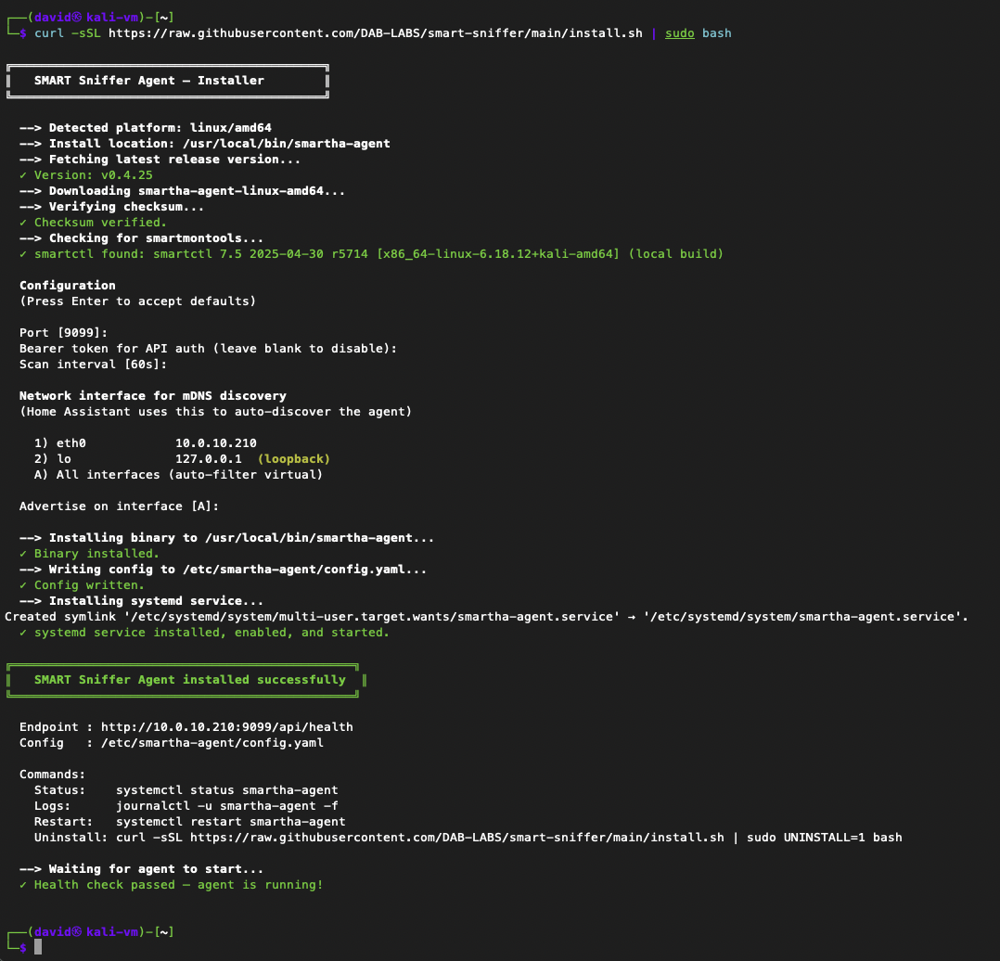
</p>

<details>
<summary>Uninstall the agent</summary>

```bash
curl -sSL https://raw.githubusercontent.com/DAB-LABS/smart-sniffer/main/install.sh | sudo UNINSTALL=1 bash
```

Stops the service, removes the binary, config, and service files.

</details>

### 2. Add the integration to Home Assistant

**Via HACS (recommended):**

1. Open HACS → three-dot menu → **Custom repositories**
2. Add `https://github.com/DAB-LABS/smart-sniffer` · Category: **Integration**
3. Download **SMART Sniffer** → Restart HA

**Manual:** Copy `custom_components/smart_sniffer/` into your HA `custom_components/` directory and restart.

### 3. Connect to the agent

**Auto-discovery (recommended):** The agent advertises itself via mDNS. After a few seconds Home Assistant will show a discovery notification — just click **Add** and you're done. If the agent has a bearer token, you'll be prompted for it.

<p align="center">
  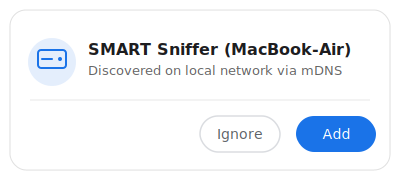
</p>

**Manual:** **Settings → Devices & Services → Add Integration → SMART Sniffer** — enter the agent's host, port, optional token, and polling interval.

Every drive on the machine appears as its own HA device.

<br>

## Screenshots

<table>
  <tr>
    <td align="center"><strong>NVMe SSD — Sensors</strong></td>
    <td align="center"><strong>NVMe SSD — Diagnostics</strong></td>
  </tr>
  <tr>
    <td>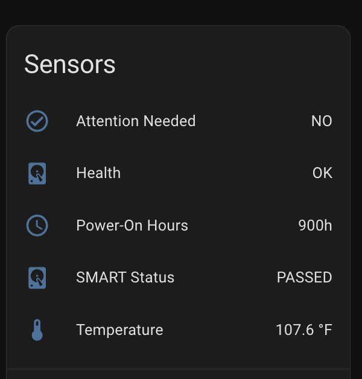</td>
    <td>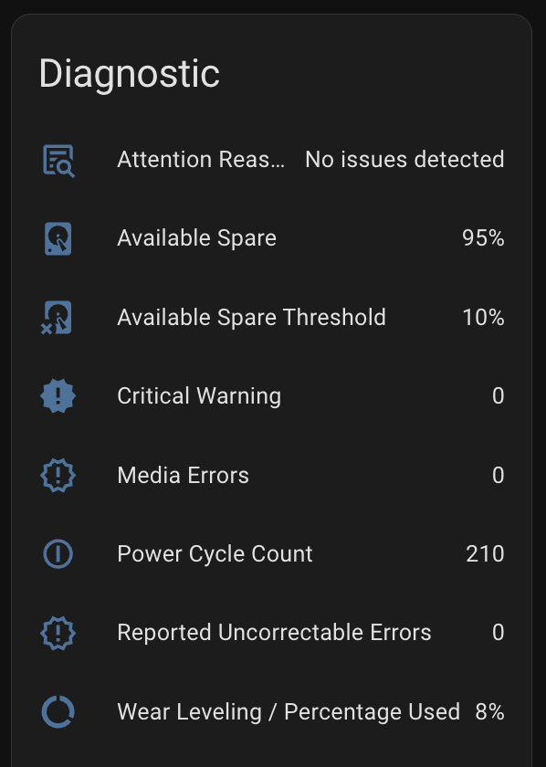</td>
  </tr>
  <tr>
    <td align="center"><strong>SATA SSD — Sensors</strong></td>
    <td align="center"><strong>SATA SSD — Diagnostics</strong></td>
  </tr>
  <tr>
    <td>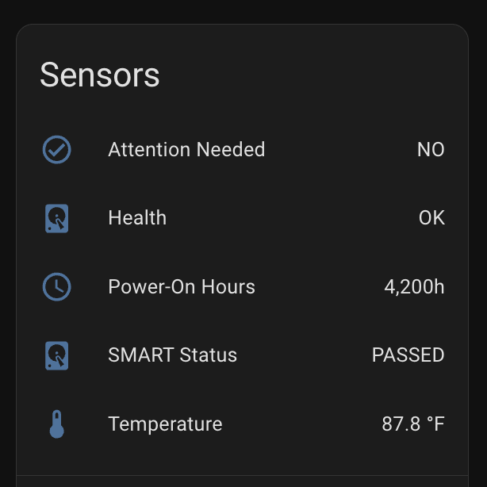</td>
    <td>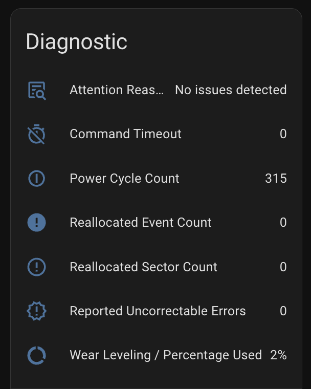</td>
  </tr>
  <tr>
    <td align="center"><strong>Attention: YES (Critical)</strong></td>
    <td align="center"><strong>Trigger Reason in Diagnostics</strong></td>
  </tr>
  <tr>
    <td>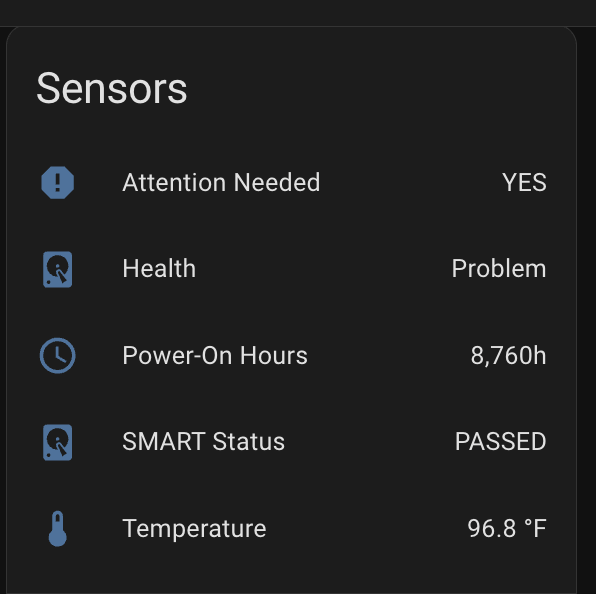</td>
    <td>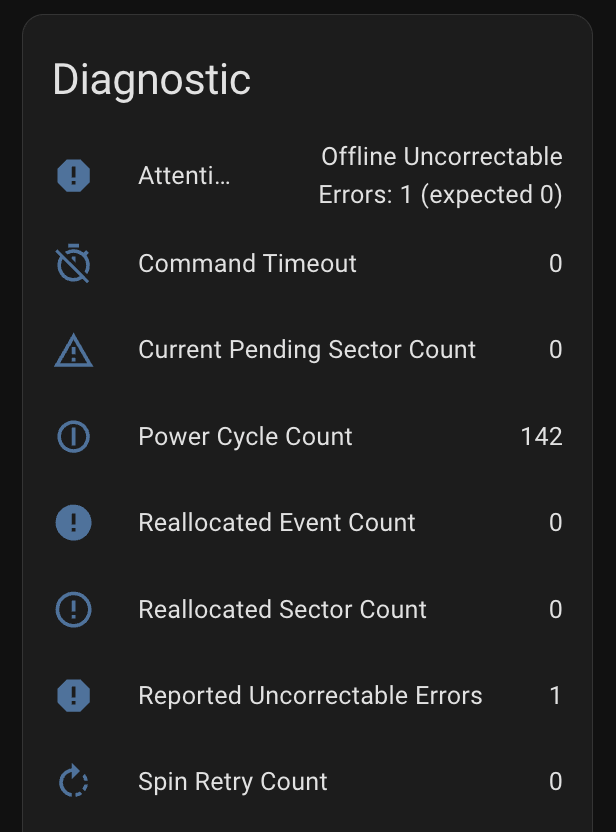</td>
  </tr>
  <tr>
    <td align="center"><strong>Attention: MAYBE (Warning)</strong></td>
    <td align="center"><strong>Warning Reason in Diagnostics</strong></td>
  </tr>
  <tr>
    <td>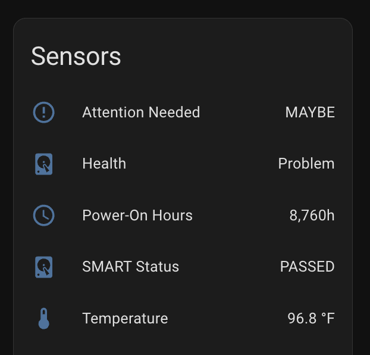</td>
    <td>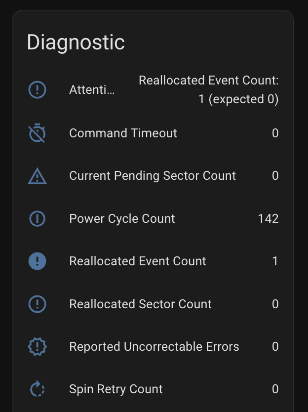</td>
  </tr>
</table>

<details>
<summary><strong>🔌 What about USB drives?</strong></summary>

<br>

External drives connected via USB enclosures typically block SMART passthrough. SMART Sniffer detects this and marks the drive as `UNSUPPORTED` with `Health: Unknown`.

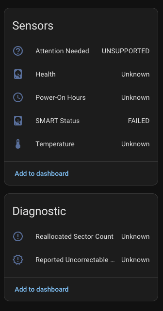

This is the most common "why isn't my drive showing data?" scenario. It's a hardware limitation of the USB bridge chip, not a bug.

</details>

<br>

## How It Works

<p align="center">
  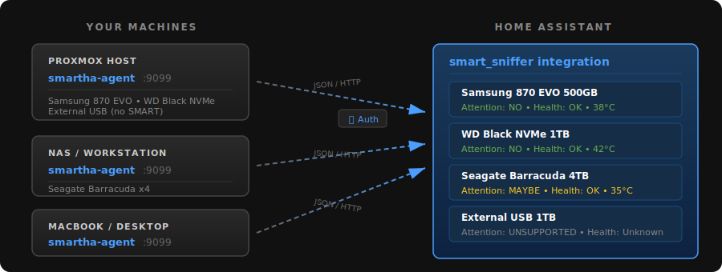
</p>

Each machine runs a lightweight `smartha-agent` binary that wraps `smartctl` and serves SMART data over HTTP. The HA integration polls each agent and creates devices, sensors, and health alerts for every drive it finds.

<br>

<details>
<summary><strong>Entities per drive</strong></summary>

<br>

Each drive gets its own HA device. Entities are created dynamically — if a drive doesn't report an attribute, the sensor is simply not created.

**Sensors:**

| Entity | Description |
|--------|-------------|
| Attention Needed | Proactive health alert — `NO` / `MAYBE` / `YES` / `UNSUPPORTED` |
| Health | SMART pass/fail — OK, Problem, or Unknown |
| Temperature | Current drive temp (°C) |
| Power-On Hours | Total hours powered on |
| SMART Status | Raw SMART verdict (PASSED / FAILED) |

**Diagnostic sensors** (conditional):

| Entity | Description |
|--------|-------------|
| Reallocated Sector Count | Bad sectors remapped to spares (ATA) |
| Reported Uncorrectable Errors | Unrecoverable read/write errors (ATA) |
| Wear Leveling / Percentage Used | SSD endurance indicator |
| Power Cycle Count | Total power on/off cycles |
| Reallocated Event Count | Individual reallocation events (ATA) |
| Spin Retry Count | Motor spin-up retries — HDD only |
| Command Timeout | Internal command timeouts |
| Available Spare | NVMe reserve block pool (%) |
| Available Spare Threshold | Manufacturer-set minimum spare (%) |
| Current Pending Sector Count | Sectors waiting for reallocation (ATA) |

</details>

<details>
<summary><strong>Attention Needed — how it classifies drives</strong></summary>

<br>

The Attention Needed sensor evaluates individual SMART attributes every poll cycle:

| State | Meaning | Action |
|-------|---------|--------|
| **NO** | All monitored indicators clear | None required |
| **MAYBE** | Early degradation signals detected | Monitor closely, plan replacement |
| **YES** | Data integrity at risk | **Back up immediately** |
| **UNSUPPORTED** | No usable SMART data | Common with USB enclosures |

**Critical triggers (→ YES):** Reallocated sectors, pending sectors, uncorrectable errors, NVMe critical_warning, NVMe media_errors, spare depletion below threshold.

**Warning triggers (→ MAYBE):** Reallocated events, spin retry count, command timeouts, NVMe spare < 20%, NVMe percentage_used ≥ 90%.

When a drive's state changes, a persistent notification fires in HA automatically. Notifications escalate on worsening conditions and dismiss when resolved. See [attention-severity-logic.md](docs/attention-severity-logic.md) for the full specification.

</details>

<details>
<summary><strong>Agent configuration</strong></summary>

<br>

Create `config.yaml` in the working directory or `/etc/smartha-agent/`:

```yaml
port: 9099
token: "your-secret-token"    # optional — omit to disable auth
scan_interval: 60s
```

All options can also be set via CLI flags: `--port`, `--token`, `--scan-interval`.

**Authentication:** When a `token` is set, every request to the agent must include an `Authorization: Bearer <token>` header — requests without it receive a `401 Unauthorized` response. When adding the agent in Home Assistant, enter the same token in the integration's config flow. If no token is set, the agent serves data openly without auth.

**Auto-discovery:** The agent advertises itself on the local network via mDNS (Zeroconf) by default. HA automatically detects running agents and prompts you to set them up — no manual IP entry needed. Disable with `mdns: false` in config or `--no-mdns` flag. Note: mDNS is link-local, so agents on different VLANs won't be discovered without an mDNS reflector.

**Service management:**

| Platform | Status | Logs | Restart |
|----------|--------|------|---------|
| Linux | `systemctl status smartha-agent` | `journalctl -u smartha-agent -f` | `systemctl restart smartha-agent` |
| macOS | `launchctl list \| grep smartha` | `tail -f /var/log/smartha-agent.log` | `sudo launchctl kickstart -k system/com.dablabs.smartha-agent` |
| Windows | `Get-Service SmartHA-Agent` | Event Viewer | `Restart-Service SmartHA-Agent` |

</details>

<details>
<summary><strong>Building from source</strong></summary>

<br>

Requires Go 1.22+.

```bash
cd agent
make              # build for current platform
make all          # cross-compile all targets
make release      # build all + generate SHA256 checksums
make clean        # remove build artifacts
```

Binaries output to `agent/build/`.

| Platform | Architecture | Binary | Status |
|----------|-------------|--------|--------|
| Linux | amd64, arm64 | `smartha-agent-linux-amd64`, `-arm64` | Tested |
| macOS | amd64 (Intel), arm64 (Apple Silicon) | `smartha-agent-darwin-amd64`, `-arm64` | Tested |
| Windows | amd64 | `smartha-agent-windows-amd64.exe` | Not yet tested |

</details>

<br>

## Documentation

| Doc | Description |
|-----|-------------|
| [Attention Severity Logic](docs/attention-severity-logic.md) | State machine, classification rules, notification lifecycle |
| [Trigger → Entity Map](docs/attention-trigger-entity-map.md) | Every attention trigger mapped to its sensor entity and icon |
| [Early Warning Attributes](docs/early-warning-attributes.md) | Which SMART attributes predict failure and why |
| [Attribute Name Variants](docs/smart-attribute-name-variants.md) | Manufacturer-specific `smartctl` name mapping research |
| [Mock Agent](docs/mock-agent.md) | Testing tool — fake agent with controllable drives |
| [Build Journal](docs/build-journal.md) | Design decisions, iteration history, known issues |

## Roadmap

- [ ] HAOS App — run the agent directly on Home Assistant OS
- [ ] Integration icons for HA integrations page
- [ ] MQTT agent mode
- [ ] Custom Lovelace card
- [ ] Temperature-based attention triggers (absolute threshold + trend over time)
- [ ] Configurable alert thresholds via options flow
- [ ] SAS/SCSI drive support

## Testing

The integration has been tested against the included [Mock Agent](docs/mock-agent.md) — a standalone Python tool that simulates a `smartha-agent` with fully controllable fake drives. It serves the same API as the real agent, with a web dashboard for changing SMART attributes in real time. Useful for validating attention state transitions, notification behavior, and new drive types without waiting for real hardware to degrade.

```bash
python3 tools/mock-agent.py --port 9100 --preload sata_hdd,nvme,usb_blocked
```

Point the HA integration at `localhost:9100` and you're testing.

## Contributing

Found a bug? Have a drive that isn't mapping correctly? See [CONTRIBUTING.md](CONTRIBUTING.md) for how to help.

Drive-specific `smartctl -a --json` output samples are especially welcome — they help us catch manufacturer name variants we haven't seen yet.

---

<p align="center">
  MIT License · Built by <a href="https://github.com/DAB-LABS">DAB-LABS</a>
</p>
