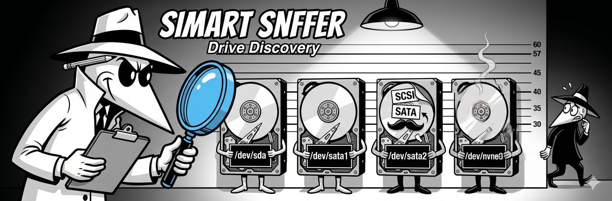

<p align="center">
  
</p>

# Drive Discovery (`--discover`)

The `--discover` command probes every drive on your system, tests whether SMART data is readable, detects protocol mismatches, and offers to write the correct config for you. It's the fastest way to get SMART Sniffer working on NAS devices and non-standard hardware.

## When to use it

Run `--discover` when:

- You just installed the agent on a NAS (Synology, QNAP, TrueNAS) and want to confirm your drives are detected
- Drives show as UNSUPPORTED in Home Assistant
- You added or replaced a drive and want the agent to pick it up
- You're not sure if your hardware needs `device_overrides`

You don't need `--discover` on standard Linux, macOS, or Windows machines with SATA or NVMe drives. Those are detected automatically by `smartctl --scan` and work out of the box.

## How to run it

```bash
sudo smartha-agent --discover
```

The agent must already be installed. `--discover` uses the same `smartctl` binary the agent uses at runtime, so if the agent works, discovery works.

## What it does

Discovery runs in three phases:

### Phase 1: Standard scan

Runs `smartctl --scan-open` (or `--scan` as fallback) to find all drives the OS knows about. For each drive, it tests whether SMART data is readable using the reported protocol.

### Phase 2: Platform-specific probing

If the system is detected as Synology (via `/etc/synoinfo.conf` or the presence of `/dev/sata1`), discovery also probes the proprietary `/dev/sata1` through `/dev/sata8` paths that `smartctl --scan` doesn't find on its own.

QNAP is detected via `/etc/config/qpkg.conf` or `/sbin/get_hd_smartinfo`. On QNAP, the agent notes that SAT fallback is handled automatically at runtime.

### Phase 3: SAT fallback testing

For any drive where the initial protocol (usually SCSI) fails to return SMART data, discovery automatically retries with SAT (SCSI-to-ATA Translation). NAS devices commonly report SATA drives as SCSI through their HBA controllers -- SAT is the fix.

## Example output

### Standard Linux (no issues)

```
SMART Sniffer -- Drive Discovery

Scanning drives...

  /dev/sda
    Protocol:   ATA
    SMART data: Yes
    Model:      Samsung SSD 870 EVO 1TB
    Serial:     S1234567890
    Result:     OK

  /dev/nvme0
    Protocol:   NVMe
    SMART data: Yes
    Model:      WD Black SN770 500GB
    Serial:     W1234567890
    Result:     OK

Found 2 drive(s). 2 readable.
No config changes needed.
```

### Synology (protocol fix needed)

```
SMART Sniffer -- Drive Discovery

Scanning drives...

  Standard scan found 0 drives.

Detected Synology platform. Probing /dev/sata paths...

  /dev/sata1
    Scan protocol: sat
    SMART data:    Yes
    Model:         WD Red Plus 4TB
    Serial:        WD-WCC7K1234567
    Result:        Needs device_override (not found by standard scan)

  /dev/sata2
    Scan protocol: sat
    SMART data:    Yes
    Model:         WD Red Plus 4TB
    Serial:        WD-WCC7K7654321
    Result:        Needs device_override (not found by standard scan)

  /dev/sata3 -- not present
  /dev/sata4 -- not present

Found 2 drive(s). 2 readable.
2 drive(s) need device_overrides in your config.

Proposed additions to config.yaml:

  device_overrides:
    - device: /dev/sata1
      protocol: sat
    - device: /dev/sata2
      protocol: sat

Write to /etc/smart-sniffer/config.yaml? [Y/n]:
```

### QNAP (auto-handled)

```
SMART Sniffer -- Drive Discovery

Scanning drives...

  /dev/sda
    Scan protocol: SCSI
    SMART data:    No
    SAT retry:     Yes -- SMART data available
    Model:         Seagate IronWolf 8TB
    Serial:        ZA1234567
    Result:        OK (agent will auto-detect SAT at runtime)

Detected QNAP platform.

Found 1 drive(s). 1 readable.
No config changes needed -- the agent handles protocol detection automatically.
```

## What it writes to config

When drives need `device_overrides`, discovery shows you exactly what it will write and asks for confirmation. It only adds a `device_overrides` section -- it never modifies your existing config fields (port, scan_interval, token, etc.).

Before writing, it automatically backs up your config to `config.yaml.bak`.

Example addition:

```yaml
device_overrides:
  - device: /dev/sata1
    protocol: sat
  - device: /dev/sata2
    protocol: sat
```

After writing, restart the agent to apply:

```bash
sudo systemctl restart smart-sniffer
```

## Dry run mode

To see what discovery would find without modifying your config:

```bash
sudo smartha-agent --discover --no-write
```

This runs the full scan and shows the proposed config changes but skips the write step.

## Re-running discovery

You can re-run `--discover` at any time. Common reasons:

- **Added a new drive** -- re-run to detect it and add its override
- **Replaced a drive** -- the new drive may have a different path or protocol
- **Drives show as UNSUPPORTED after an update** -- re-run to re-test protocol detection

**Important:** `--discover` appends `device_overrides` to your config. If you run it multiple times, you may end up with duplicate entries. Check your `config.yaml` after re-running and remove any duplicates.

## When discovery isn't enough

Discovery handles protocol detection and Synology/QNAP platform quirks. It doesn't help with:

- **Virtual disks in VMs** -- virtual disk controllers don't pass SMART commands regardless of protocol. See the [Virtual Machines guide](guides/virtual-machines.md) or the [Proxmox guide](guides/proxmox.md).
- **Hardware RAID controllers** -- if your drives sit behind a hardware RAID controller (MegaRAID, Adaptec, etc.), `smartctl` may need a RAID-specific device type (`-d megaraid,0`). Discovery doesn't probe RAID controllers yet. Set these overrides manually in `config.yaml`.
- **USB-attached drives** -- some USB enclosures don't pass SMART commands. Try `-d sat` manually with `smartctl` to test.

## Config preservation warning

If you later reinstall the agent and choose "N" at the "Keep current settings?" prompt, the installer rewrites `config.yaml` from scratch. This will erase your `device_overrides`. The installer does not currently preserve custom config sections during reconfigure.

To avoid losing your overrides:

1. Choose "Y" (keep current settings) during reinstall if you only need to update the agent binary
2. Back up your `config.yaml` before reinstalling
3. Re-run `--discover` after reinstalling if you chose "N"

## Manual device_overrides

You don't have to use `--discover`. You can write `device_overrides` by hand in `config.yaml`:

```yaml
device_overrides:
  - device: /dev/sata1
    protocol: sat
  - device: /dev/sata2
    protocol: sat
  - device: /dev/sdb
    protocol: scsi
```

Each entry needs:

- `device` -- the block device path (e.g., `/dev/sata1`, `/dev/sda`)
- `protocol` -- the smartctl device type (`sat`, `scsi`, `nvme`, `ata`, or a RAID type like `megaraid,0`)

Discovery is just the automated way to generate these entries. The result is the same either way.

## Related

- [Synology guide](guides/synology.md) -- `/dev/sataX` paths and SynoCli smartmontools
- [QNAP guide](guides/qnap.md) -- SCSI-to-SAT protocol detection
- [TrueNAS SCALE guide](guides/truenas-scale.md) -- ZFS and filesystem monitoring
- [Platform Install Paths](platform-install-paths.md) -- where the agent and config live on each platform
