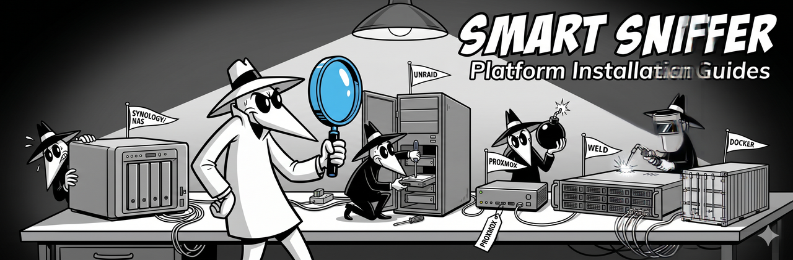

  

# Platform Installation Guides

SMART Sniffer works out of the box on most Linux, macOS, and Windows machines. But NAS devices, hypervisors, and containerized environments often need extra steps -- different device paths, protocol quirks, network bridge configs, or virtual disk limitations.

These guides walk through each platform step by step.

## Guides

| Platform | What's covered |
|----------|---------------|
| [Proxmox + HA OS](proxmox.md) | Agent on the Proxmox host, integration in the HA VM. mDNS discovery, firewall rules, manual fallback. |
| [Synology DSM](synology.md) | SynoCli for smartmontools 7.x, `/dev/sataX` device paths, `--discover` setup. |
| [QNAP QTS](qnap.md) | SAT protocol fallback, mDNS interface selection, LXC bridge exclusion. |
| [TrueNAS SCALE](truenas-scale.md) | ZFS context, btrfs-progs for filesystem monitoring, immutable rootfs notes. |
| [Unraid](unraid.md) | Community guide -- br0 bridge, Docker-based deployment. *(In progress)* |
| [Docker](docker.md) | Containerized agent deployment, device passthrough, known limitations. *(In progress)* |
| [Virtual Machines](virtual-machines.md) | Generic VM guide -- ESXi, Hyper-V, VirtualBox. Why SMART data needs the host. |

## Quick reference

**The one rule for VMs and hypervisors:** SMART data lives in the physical drive's firmware. Virtual disk controllers don't pass SMART commands through. Install the agent on the host (where the drives are), not in the VM. The HA integration in the VM discovers the agent over the network.

**The one rule for NAS devices:** Run `smartha-agent --discover` after install. It probes every drive, detects protocol mismatches, and offers to write the config for you.

## Contributing

Found a platform we haven't covered? Fix something that's wrong? Platform guides live in [`docs/guides/`](https://github.com/DAB-LABS/smart-sniffer/tree/main/docs/guides) and follow the same PR workflow as the rest of the repo. We especially welcome first-hand experience from users running SMART Sniffer on platforms marked *(In progress)*.
