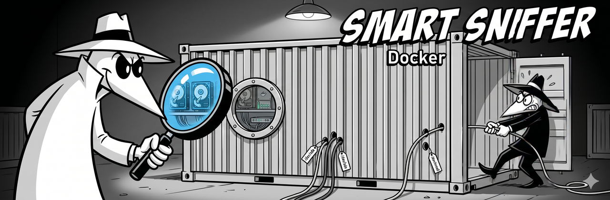

<p align="center">
  
</p>

# Docker

> **This guide is a work in progress.** The community Docker image is maintained by [@fireinice](https://github.com/fireinice). Official Docker support is on the roadmap but not yet shipped. Contributions welcome.

## Community Docker image

[@fireinice](https://github.com/fireinice) maintains a Docker image for the SMART Sniffer agent:

- **GitHub:** [fireinice/docker-smart-sniffer](https://github.com/fireinice/docker-smart-sniffer)
- **Docker Hub:** [fireinice/smart-sniffer](https://hub.docker.com/r/fireinice/smart-sniffer)

The image includes auto-generated docker-compose configuration with per-drive capability scoping.

## Key considerations

### Device passthrough

The agent needs direct access to your physical drives (`/dev/sdX`, `/dev/nvmeXnY`). Docker containers don't see host devices by default -- you need to pass them through explicitly using `--device` flags or compose `devices:` entries.

### Privileged mode vs. device scoping

Running the container with `--privileged` gives it access to all host devices, which works but is broader than necessary. The community image supports per-drive device scoping, which is more secure -- only the specific drives you want monitored are passed into the container.

### Filesystem monitoring limitation

Disk usage monitoring (`/api/filesystems`) is not yet supported in Docker deployments. The agent reports host filesystem paths, but inside a container those paths don't map correctly to the host's actual mountpoints. Container-aware path mapping (via a `MNT_PREFIX` environment variable) is [on the roadmap](../../README.md#roadmap).

### mDNS and networking

For mDNS auto-discovery to work, the container needs to be on the host network (`--network host`). Bridge networking isolates the container's network stack, which breaks mDNS multicast. If you can't use host networking, configure the HA integration manually with the host's IP and the agent's port.

## Basic setup

```yaml
# docker-compose.yml (simplified example)
version: '3'
services:
  smart-sniffer:
    image: fireinice/smart-sniffer:latest
    network_mode: host
    devices:
      - /dev/sda:/dev/sda
      - /dev/sdb:/dev/sdb
    volumes:
      - ./config.yaml:/etc/smart-sniffer/config.yaml
    restart: unless-stopped
```

See the [community image documentation](https://github.com/fireinice/docker-smart-sniffer) for the full setup guide, including auto-generated compose files.

## Contributing

If you're running the agent in Docker, we'd like to know:

- Which host OS are you running Docker on?
- Did you use `--network host` or bridge networking?
- Did mDNS discovery work, or did you use manual integration setup?
- Any issues with device passthrough on your platform?

Open a PR to improve this guide, or share your experience in a [GitHub issue](https://github.com/DAB-LABS/smart-sniffer/issues).

## Related

- [Unraid guide](unraid.md) -- Docker is the primary deployment method on Unraid
- [Main README: Community Deployments](../../README.md#community-deployments) -- links to community Docker image
- [Main README: Roadmap](../../README.md#roadmap) -- container-aware filesystem reporting status
