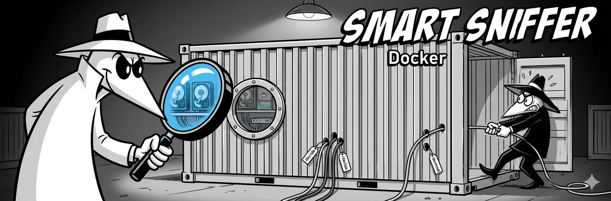

<p align="center">
  
</p>

# Docker

**There is no official SMART Sniffer Docker image.** The agent runs fine inside a
container, though, and on NAS systems where containers are the normal way to run
software, that is often the easiest route. This page explains what a container
needs so you can set one up yourself, or have an AI coding assistant do it for
you using the prompt at the bottom.

If your machine lets you run the regular installer, use that instead. It handles
everything on this page for you.

## Why there is no image

A published image has to be rebuilt every release, kept on a current base, and
supported across every NAS vendor's container UI. That is a lot of upkeep for a
small project, and a stale image is worse than none: it quietly runs an old agent
missing months of fixes.

Everything the agent needs is already published with each release, so you can
assemble a container from standard parts without us maintaining one.

## What the container needs

### 1. The agent binary

Each [release](https://github.com/DAB-LABS/smart-sniffer/releases/latest)
includes Linux builds for `amd64`, `arm64` and 32-bit `arm`. They are statically
linked, so they run on any Linux base image with no extra libraries. Every
release also publishes a `checksums.txt` file. Check the binary against it.

Pin a specific version rather than "latest", so an update only happens when you
choose it.

### 2. smartmontools

The agent is a wrapper around `smartctl`, and it needs **smartmontools 7.0 or
newer** inside the container. Most base images offer it as a standard package.
The agent finds `smartctl` on its own. Nothing needs configuring.

### 3. Access to the drives

Containers cannot see the host's disks by default. Each drive you want monitored
has to be passed in as a device, such as `/dev/sda` or `/dev/nvme0n1`.

Reading SMART data also needs extra permissions:

| Drive type | Capability needed |
|---|---|
| SATA and SAS | `SYS_RAWIO` |
| NVMe | `SYS_ADMIN` |

Be aware that `SYS_ADMIN` is a broad permission, close to full root. Some NAS
container UIs cannot grant individual capabilities and only offer "privileged
mode." That works, but it gives the container access to everything on the host.

The device list is fixed when the container is created. A new, replaced or
renamed disk means updating the container's device list and recreating it.

### 4. Networking

Home Assistant finds agents automatically over mDNS, and **mDNS only works with
host networking**. On a bridged network the agent still runs, but you add it in
Home Assistant by hand, using the NAS's IP address and port `9099`.

### 5. Configuration

The agent reads `/etc/smartha-agent/config.yaml`, or any path you pass with
`--config`. Mount your config file into the container. Common settings:
`port`, `token`, `scan_interval`, `exclude_devices`, and `device_overrides` for
NAS drives that need a specific protocol.

### 6. Disk usage (optional)

Disk usage monitoring needs to see the host's filesystems, not the container's.
Mount the host filesystem into the container read-only, at a path such as
`/host`, and tell the agent where it is with `mount_prefix` in the config, or the
`SMARTHA_MOUNT_PREFIX` environment variable. Without this, SMART health still
works; only the disk usage sensors are missing.

### 7. Keeping it running

Set the container to restart automatically, so the agent comes back after a NAS
reboot.

## Checking that it works

From a browser or `curl` on your network:

- `http://<nas-ip>:9099/api/health` shows the agent version and drive count
- `http://<nas-ip>:9099/api/drives` lists the drives the agent can read

If drives are missing, run the agent's diagnostic inside the container with
`smartha-agent --discover`. It shows what each drive responds to and suggests
config fixes. Paste its output into an issue if you need help.

## Updating

Change the pinned version, check the new binary against that release's
`checksums.txt`, and recreate the container. Your config file carries over.

## Platform notes

Each NAS vendor's container UI works a little differently, mostly in where you
add devices and capabilities. See the Docker section of your platform's guide:

- [Unraid](unraid.md)
- [TrueNAS SCALE](truenas-scale.md)
- [Synology DSM](synology.md)
- [QNAP QTS](qnap.md)

Running in Docker on a platform not listed? Tell us what worked in a
[GitHub issue](https://github.com/DAB-LABS/smart-sniffer/issues) and we will add it.

---

## For AI coding assistants

If you are using an AI assistant to build your container, give it the prompt
below. Fill in the three lines at the top first.

```text
Set up the SMART Sniffer agent to run in Docker on my machine.

My platform: <for example Unraid 7, TrueNAS SCALE 25.04, Synology DSM 7.2, plain Debian>
My drives: <paste the output of `lsblk -d -o NAME,TYPE,TRAN,MODEL`>
Disk usage monitoring: <yes or no>

Requirements:
- Do not use any prebuilt SMART Sniffer image. Use a small, maintained public base
  image and install smartmontools 7.0 or newer from its package manager.
- Download the agent from https://github.com/DAB-LABS/smart-sniffer/releases
  as the static binary for my CPU: smartha-agent-linux-amd64, -arm64 or -arm.
  Pin a specific release version, never "latest". Install it inside the
  container as /usr/local/bin/smartha-agent.
- Verify the binary's SHA-256 against checksums.txt from the same release, and
  refuse to start if it does not match.
- Pass through only the drives I listed as devices. Add the SYS_RAWIO capability
  if any are SATA or SAS, and SYS_ADMIN if any are NVMe. Only fall back to
  privileged mode if my platform cannot grant individual capabilities, and tell
  me if you do.
- Use host networking so Home Assistant can discover the agent over mDNS. If my
  platform cannot, tell me, and remind me to add the agent in Home Assistant
  manually using the host IP and port 9099.
- Mount a config file at /etc/smartha-agent/config.yaml. Start from:
    port: 9099
    scan_interval: 60s
- If I want disk usage, mount the host root read-only at /host and set
  mount_prefix: /host in the config.
- Set the container to restart unless stopped.
- Produce the setup in whatever form my platform's container UI accepts (for
  example a compose file, or step-by-step fields for the platform's app screen),
  and explain each permission you add and why.
- Afterwards, tell me to confirm it works by opening http://<host-ip>:9099/api/health
  and http://<host-ip>:9099/api/drives, and to run `smartha-agent --discover`
  inside the container if any drive is missing.

Reference: https://github.com/DAB-LABS/smart-sniffer/blob/main/docs/guides/docker.md
```

Check what the assistant produces before you run it, especially the permissions.
