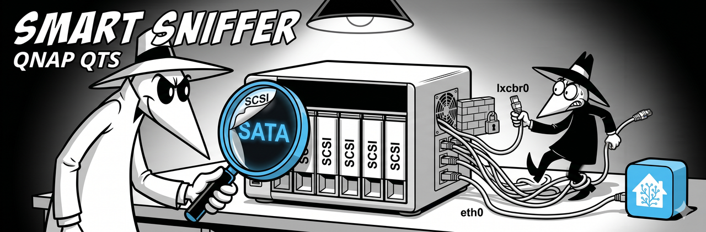

<p align="center">
  
</p>

# QNAP QTS

QNAP NAS devices use HBA controllers that report SATA drives as SCSI to the operating system. SMART Sniffer handles this automatically since v0.5.5, but there are a couple of QNAP-specific network quirks to watch for during setup.

## What's different about QNAP

Three things to know:

1. **SCSI protocol misreport.** QNAP's HBA controllers present SATA drives as SCSI. When smartctl queries with the SCSI protocol, it reports "SMART support is: Unavailable." But the drives are actually SATA and work fine with SAT (SCSI-to-ATA Translation). The agent detects and handles this automatically.

2. **LXC bridge interfaces.** QNAP runs Docker containers via LXC, which creates bridge interfaces like `lxcbr0`. If the agent advertises mDNS on `lxcbr0`, it publishes an internal container IP (like `10.0.3.1`) instead of your LAN address. Home Assistant can't reach that IP.

3. **Standard device paths.** Unlike Synology, QNAP uses standard `/dev/sdX` paths. `smartctl --scan` finds them normally.

## Step 1: Install the agent

SSH into your QNAP and run:

```bash
curl -sSL https://raw.githubusercontent.com/DAB-LABS/smart-sniffer/main/install.sh | sudo bash
```

**Important: pick the right network interface during install.** The installer will show an interface picker. Choose your LAN interface (usually `eth0` or similar) -- **not** `lxcbr0`, `lxdbr0`, `docker0`, or any bridge interface. This ensures mDNS advertises your real LAN IP.

If you're not sure which interface is which:

```bash
ip addr show
```

Look for the interface with your LAN IP (e.g., `192.168.1.x`).

## Step 2: Verify protocol detection

After install, check that the agent found your drives with the correct protocol:

```bash
sudo smartha-agent --discover
```

Since v0.5.5, the agent uses `--scan-open` on its first poll cycle, which detects SATA drives behind SCSI-reporting HBAs. If a drive still comes back as SCSI, the agent retries with SAT automatically. You should see output like:

```
/dev/sda -- Seagate IronWolf 4TB (ZDH1ABCD)
  Protocol: SCSI → SAT fallback succeeded
  SMART: Available

/dev/sdb -- Seagate IronWolf 4TB (ZDH1EFGH)
  Protocol: SCSI → SAT fallback succeeded
  SMART: Available
```

If `--discover` finds drives and offers to write config, accept it. Otherwise, the auto-detection is handling things and no manual config is needed.

## Step 3: Add the integration to Home Assistant

1. **HACS** --> Custom repositories --> `https://github.com/DAB-LABS/smart-sniffer` (Integration)
2. Download **SMART Sniffer** --> Restart HA
3. The agent advertises via mDNS -- HA should discover it automatically

## Troubleshooting

### HA discovers the agent but can't connect (wrong IP)

This is the `lxcbr0` issue. The agent advertised an internal container bridge IP instead of your LAN IP.

Check what IP the agent is advertising:

```bash
journalctl -u smartha-agent | grep "preferred IP"
```

If it shows something like `10.0.3.1` instead of your LAN IP, the agent picked the wrong interface. Fix it:

```bash
sudo nano /etc/smartha-agent/config.yaml
```

Set `advertise_interface` to your LAN interface:

```yaml
advertise_interface: eth0
```

Restart:

```bash
sudo systemctl restart smartha-agent
```

Since v0.5.5.4, the agent's interface filter excludes `lxcbr0` and `lxdbr0` by default. If you're on an older version, upgrading fixes this automatically:

```bash
curl -sSL https://raw.githubusercontent.com/DAB-LABS/smart-sniffer/main/install.sh | sudo bash
```

### Drives show as UNSUPPORTED or no SMART data

This means the SAT fallback didn't kick in. Check the agent logs:

```bash
journalctl -u smartha-agent | grep -i "sat\|protocol\|scsi"
```

If you see "device open failed" errors, add manual overrides:

```yaml
device_overrides:
  - device: /dev/sda
    protocol: sat
  - device: /dev/sdb
    protocol: sat
```

Restart the agent after editing config.

### I have a hardware RAID controller

Some QNAP models (higher-end rackmount units) have hardware RAID controllers. In that case, drives are hidden behind the RAID layer and need explicit protocol flags. See the [Hardware RAID Controllers guide](raid-controllers.md) for `device_overrides` with RAID-specific protocols like `megaraid,0`.

Most consumer QNAP models use a standard HBA (not hardware RAID), so this doesn't apply to the typical setup.

## Example config

A typical QNAP `config.yaml`:

```yaml
port: 9099
scan_interval: 120
advertise_interface: eth0
```

In most cases, you don't need `device_overrides` -- the agent's automatic SAT fallback handles QNAP's SCSI-to-SATA mismatch. Only add overrides if `--discover` tells you to or if you're seeing UNSUPPORTED drives.

## Related

- [Synology guide](synology.md) -- similar protocol issues, different device path quirks
- [Platform Install Paths](../platform-install-paths.md) -- install locations on different platforms
- [Main README: NAS & RAID Setup](../../README.md#nas--raid-setup) -- quick reference for all NAS platforms
