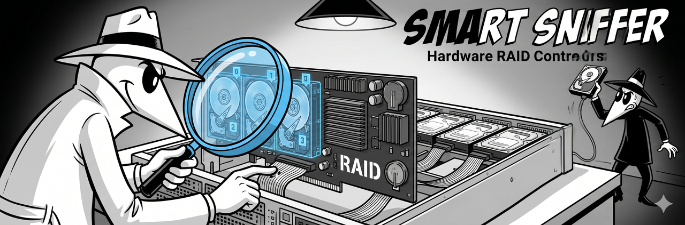

<p align="center">
  
</p>

# Hardware RAID Controllers

Hardware RAID controllers (MegaRAID, HP SmartArray, Adaptec, 3ware, Areca, HPT) sit between the operating system and the physical drives. The OS sees a single logical disk (the RAID volume), not the individual drives behind it. `smartctl --scan` finds the logical disk but can't read SMART data from it -- SMART lives in the firmware of each physical drive, and the RAID controller blocks direct access by default.

To reach the physical drives, `smartctl` needs a RAID-specific device type flag (`-d megaraid,0`, `-d cciss,0`, etc.) that tells it to talk through the controller's passthrough interface. SMART Sniffer supports this via `device_overrides` in your config.

## Current limitations

**`--discover` does not probe RAID controllers yet.** Discovery finds drives that the OS exposes directly. Drives behind hardware RAID are hidden from the OS and require manual configuration. RAID probing is on the roadmap but not yet implemented.

**Software RAID (mdraid, LVM, ZFS) is different.** Software RAID uses standard block devices (`/dev/sdX`). The drives are visible to the OS and `smartctl` reads them normally. You don't need `device_overrides` for software RAID -- the agent picks them up automatically.

## Step 1: Identify your controller

Find out what RAID controller you have:

```bash
# Linux -- check PCI devices
lspci | grep -i raid

# Or check for loaded kernel modules
lsmod | grep -iE "megaraid|cciss|3w-|arcmsr|hpsa"
```

Common output and what it means:

| `lspci` output contains | Controller family | smartctl device type |
|------------------------|-------------------|---------------------|
| MegaRAID, LSI, Avago, Broadcom | MegaRAID | `megaraid,N` |
| Smart Array, HP, HPE | HP SmartArray | `cciss,N` |
| 3ware, AMCC | 3ware | `3ware,N` |
| Areca, ARC-xxxx | Areca | `areca,N` or `areca,N/E` |
| HighPoint, HPT | HighPoint | `hpt,L/M/N` |

`N` is the drive index (starting at 0). Each physical drive behind the controller gets its own index.

## Step 2: Find your drives

Each controller family has its own CLI tool for listing physical drives. You don't strictly need these tools -- you can also probe by incrementing the index until `smartctl` returns an error -- but they make life easier.

### MegaRAID (most common)

```bash
# If you have storcli or MegaCli installed:
storcli /c0 /eall /sall show
# or
MegaCli -PDList -aALL | grep -E "Slot|Device Id"

# Without vendor tools, just probe incrementally:
sudo smartctl -d megaraid,0 -i /dev/sda
sudo smartctl -d megaraid,1 -i /dev/sda
sudo smartctl -d megaraid,2 -i /dev/sda
# ... keep going until "No such device"
```

The device path (`/dev/sda`) is the logical RAID volume. All drives behind the controller are accessed through the same path with different indices.

### HP SmartArray

```bash
# If you have ssacli (or the older hpacucli):
ssacli ctrl all show config detail | grep -E "physicaldrive|Port|Bay"

# Probe incrementally:
sudo smartctl -d cciss,0 -i /dev/sda
sudo smartctl -d cciss,1 -i /dev/sda
```

### 3ware

```bash
# If you have tw_cli:
tw_cli /c0 show

# Probe incrementally:
sudo smartctl -d 3ware,0 -i /dev/twl0
sudo smartctl -d 3ware,1 -i /dev/twl0
```

Note: 3ware uses `/dev/twlN` or `/dev/twaN` device paths, not `/dev/sdX`.

### Areca

```bash
# Probe incrementally:
sudo smartctl -d areca,1 -i /dev/sg0
sudo smartctl -d areca,2 -i /dev/sg0
```

Areca uses 1-based indexing (starts at 1, not 0). Multi-enclosure setups use the `/E` suffix: `areca,1/2` means drive 1 on enclosure 2.

## Step 3: Test SMART access

Once you know your controller type and drive count, verify SMART data is readable:

```bash
# Replace with your controller type and device path
sudo smartctl -d megaraid,0 -a /dev/sda
```

You should see full SMART output -- model, serial, attributes, health status. If you get an error about "device open failed" or "Unknown USB bridge," the device type or index is wrong.

**Test every drive.** Don't assume all drives use the same path. Some controllers expose drives on different logical volumes.

## Step 4: Configure device_overrides

Add a `device_overrides` section to your `config.yaml` with one entry per physical drive:

```yaml
device_overrides:
  - device: /dev/sda
    protocol: megaraid,0
  - device: /dev/sda
    protocol: megaraid,1
  - device: /dev/sda
    protocol: megaraid,2
  - device: /dev/sda
    protocol: megaraid,3
```

Each entry maps a device path to the smartctl `-d` protocol string. The agent treats overridden devices as first-class drives even if they are not found by `smartctl --scan`.

**Multiple controllers:** If you have more than one RAID controller (e.g., two MegaRAID cards), each has its own logical volume (`/dev/sda`, `/dev/sdb`). Map each drive to the correct logical volume path.

```yaml
device_overrides:
  # Controller 1 (/dev/sda)
  - device: /dev/sda
    protocol: megaraid,0
  - device: /dev/sda
    protocol: megaraid,1
  # Controller 2 (/dev/sdb)
  - device: /dev/sdb
    protocol: megaraid,0
  - device: /dev/sdb
    protocol: megaraid,1
```

### HP SmartArray example

```yaml
device_overrides:
  - device: /dev/sda
    protocol: cciss,0
  - device: /dev/sda
    protocol: cciss,1
```

### 3ware example

```yaml
device_overrides:
  - device: /dev/twl0
    protocol: 3ware,0
  - device: /dev/twl0
    protocol: 3ware,1
```

### Areca example

```yaml
device_overrides:
  - device: /dev/sg0
    protocol: areca,1
  - device: /dev/sg0
    protocol: areca,2
```

## Step 5: Restart the agent

```bash
sudo systemctl restart smartha-agent
```

Check the agent health endpoint to confirm drives are detected:

```bash
curl http://localhost:9099/api/health
curl http://localhost:9099/api/drives
```

Each physical drive behind the RAID controller should appear as its own device in Home Assistant with full SMART data.

## Troubleshooting

### "device open failed" or exit code 2

The device path or protocol string is wrong. Double-check:

1. Is the device path correct? (`/dev/sda` for MegaRAID/SmartArray, `/dev/twl0` for 3ware, `/dev/sg0` for Areca)
2. Is the drive index correct? Try incrementing or decrementing.
3. Does smartctl work manually? Run `sudo smartctl -d megaraid,0 -a /dev/sda` directly.

### Drives show UNSUPPORTED in Home Assistant

The agent is finding the logical RAID volume (the virtual disk) instead of the physical drives. The logical volume doesn't have SMART data. Make sure your `device_overrides` point to individual physical drives using the RAID-specific protocol string.

### Only some drives appear

You probably have more physical drives than the indices you configured. Probe higher indices until `smartctl` returns an error, then add all valid indices to your config.

### Permission denied

The agent needs root access (or appropriate capabilities) to send RAID passthrough commands. The default systemd service runs as root. If you've changed the service user, make sure it has access to the RAID device nodes.

### JBOD mode (passthrough)

Some RAID controllers can be set to JBOD (Just a Bunch of Disks) mode, which presents each drive directly to the OS without a RAID layer. In JBOD mode, drives appear as standard `/dev/sdX` devices and `smartctl --scan` finds them normally. No `device_overrides` needed. Check your controller's BIOS/firmware settings if you prefer this approach.

## Quick reference

| Controller | Device type | Device path | Indexing | Notes |
|-----------|------------|------------|----------|-------|
| MegaRAID / LSI / Broadcom | `megaraid,N` | `/dev/sdX` | 0-based | Most common in homelab servers |
| HP SmartArray | `cciss,N` | `/dev/sdX` | 0-based | HPE ProLiant servers |
| 3ware / AMCC | `3ware,N` | `/dev/twlN` or `/dev/twaN` | 0-based | Older controllers, still in use |
| Areca | `areca,N` or `areca,N/E` | `/dev/sgN` | 1-based | `/E` suffix for multi-enclosure |
| HighPoint | `hpt,L/M/N` | `/dev/sdX` | L=controller, M=channel, N=target | Less common |

## Related

- [Drive Discovery (`--discover`)](../discover.md) -- automated drive detection (does not yet probe RAID controllers)
- [Platform Install Paths](../platform-install-paths.md) -- where the agent and config live on each platform
- [QNAP guide](qnap.md) -- QNAP rackmount models may have hardware RAID controllers
