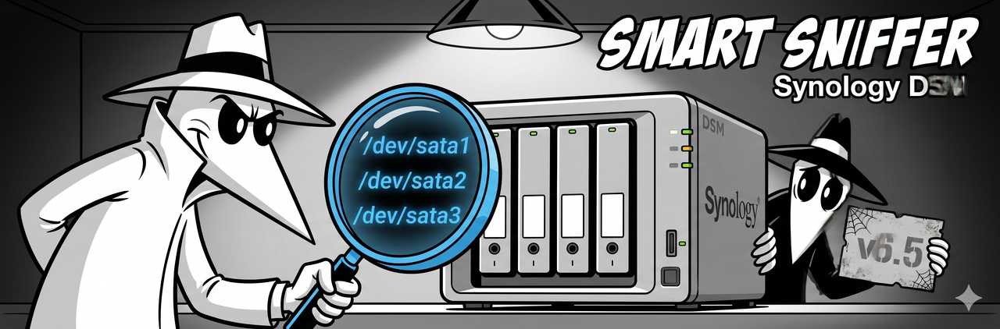

<p align="center">
  
</p>

# Synology DSM

Synology NAS devices run DSM (DiskStation Manager), which does a few things differently from standard Linux. SMART Sniffer supports Synology, but the setup needs a couple of extra steps.

## What's different about Synology

Two things trip up a standard install:

1. **Non-standard device paths.** Synology uses `/dev/sata1`, `/dev/sata2`, etc. instead of the standard `/dev/sdX` paths. `smartctl --scan` doesn't find these proprietary paths on its own.

2. **Old smartmontools.** DSM ships smartmontools 6.5, which doesn't support the `--json` flag the agent requires (needs 7.0+). The agent will log a clear error on startup if the version is too old.

Both are solved below.

## Step 1: Install smartmontools 7.x via SynoCli

DSM's built-in smartmontools is too old. Install a newer version from the SynoCommunity package source.

1. Open **Package Center** in DSM
2. Go to **Settings --> Package Sources**
3. Add a new source:
   - Name: `SynoCommunity`
   - Location: `https://packages.synocommunity.com`
4. Back in Package Center, search for **SynoCli Disk Tools**
5. Install it -- this provides smartmontools 7.4+

Verify the version:

```bash
/usr/local/bin/smartctl --version
```

You should see 7.4 or newer. The agent auto-detects this path since v0.5.5.1 -- it searches common binary locations even if the system `PATH` only finds the older version.

## Step 2: Install the agent

SSH into your Synology (enable SSH in DSM under **Control Panel --> Terminal & SNMP**):

```bash
curl -sSL https://raw.githubusercontent.com/DAB-LABS/smart-sniffer/main/install.sh | sudo bash
```

The installer handles Synology-specific setup automatically:
- Detects DSM and probes for writable install paths
- Finds the SynoCli smartmontools binary
- Sets up the systemd service

## Step 3: Run --discover

After install, run the discovery tool to detect your drives:

```bash
sudo smartha-agent --discover
```

This probes standard Linux paths (`/dev/sdX`) **and** Synology's proprietary paths (`/dev/sata1` through `/dev/sata8`). It also tests protocol detection -- Synology drives typically need SAT (SCSI-to-ATA Translation) because the HBA presents them as SCSI.

Example output:

```
Probing drives...

/dev/sata1 -- WD Red Plus 4TB (WD-WCC7K1234567)
  Protocol: SCSI → SAT fallback succeeded
  SMART: Available

/dev/sata2 -- WD Red Plus 4TB (WD-WCC7K7654321)
  Protocol: SCSI → SAT fallback succeeded
  SMART: Available

/dev/sata3 -- WD Red Plus 10TB (WD-WMC1T0ABCDEF)
  Protocol: SCSI → SAT fallback succeeded
  SMART: Available

Found 3 drives. Write device_overrides to config? (Y/n)
```

Say yes. The tool writes `device_overrides` entries to your `config.yaml` so the agent uses the correct protocol on every scan.

Restart the agent to pick up the new config:

```bash
sudo systemctl restart smart-sniffer
```

## Step 4: Add the integration to Home Assistant

Same as any other setup:

1. **HACS** --> Custom repositories --> `https://github.com/DAB-LABS/smart-sniffer` (Integration)
2. Download **SMART Sniffer** --> Restart HA
3. The agent advertises via mDNS -- HA should discover it automatically

If your Synology and HA are on different VLANs, use manual setup: **Settings --> Devices & Services --> Add Integration --> SMART Sniffer** with the NAS IP and port.

## SHR / RAID considerations

Synology's SHR (Synology Hybrid RAID) is a software RAID implementation built on top of Linux MD RAID and LVM. The individual drives are still accessible as `/dev/sataX` block devices -- SHR doesn't hide them behind a hardware RAID controller. This means SMART Sniffer can read each drive directly, which is the ideal scenario.

No `RAID=` flags or special RAID config needed for SHR setups.

## Troubleshooting

### "smartctl version too old" on startup

The agent found the system smartmontools (6.5) instead of the SynoCli version (7.4+). Since v0.5.5.1, the agent searches common paths automatically. If it's still finding the old version:

```bash
which smartctl
/usr/local/bin/smartctl --version
```

If `/usr/local/bin/smartctl` shows 7.4+ but the agent isn't using it, you can set the path explicitly in `config.yaml`:

```yaml
smartctl_path: /usr/local/bin/smartctl
```

### No drives detected

Run `smartha-agent --discover` to see what the agent finds. If it shows drives but the running agent doesn't, the config may not have the `device_overrides` entries. Check `/etc/smart-sniffer/config.yaml` (or the install path shown during setup).

### Drives show as UNSUPPORTED

This usually means the agent is querying with the wrong protocol. Synology drives need SAT. Run `--discover` and let it write the config, or add the overrides manually:

```yaml
device_overrides:
  - device: /dev/sata1
    protocol: sat
  - device: /dev/sata2
    protocol: sat
```

## Example config

A typical Synology `config.yaml`:

```yaml
port: 9099
scan_interval: 120
device_overrides:
  - device: /dev/sata1
    protocol: sat
  - device: /dev/sata2
    protocol: sat
  - device: /dev/sata3
    protocol: sat
  - device: /dev/sata4
    protocol: sat
```

## Related

- [QNAP guide](qnap.md) -- similar HBA/SAT issues on a different NAS platform
- [Platform Install Paths](../platform-install-paths.md) -- where the agent installs on Synology and other restricted filesystems
- [Main README: NAS & RAID Setup](../../README.md#nas--raid-setup) -- quick reference for all NAS platforms
