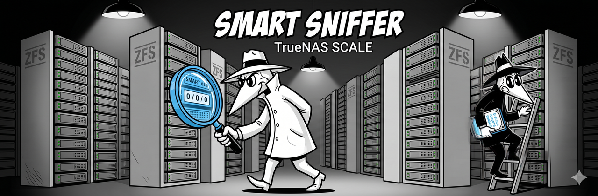

<p align="center">
  
</p>

# TrueNAS SCALE

TrueNAS SCALE is a Debian-based NAS OS built around ZFS. SMART Sniffer supports TrueNAS SCALE, though there are some platform-specific details to be aware of.

## What's different about TrueNAS SCALE

1. **ZFS, not ext4 or btrfs.** TrueNAS SCALE uses ZFS for storage management. ZFS pools present drives individually to the OS -- no hardware RAID controller hiding them -- so `smartctl --scan` finds drives normally. SMART data works out of the box.

2. **Filesystem monitoring needs btrfs-progs.** The agent's disk usage monitoring feature (`/api/filesystems`) uses `statvfs` by default, which can return zeros on ZFS. Since v0.5.6, the agent falls back to `btrfs filesystem usage --raw` when `statvfs` returns empty data. On TrueNAS SCALE, install `btrfs-progs` to enable this fallback for accurate filesystem reporting.

3. **Debian base with restrictions.** TrueNAS SCALE is built on Debian but the root filesystem may have restrictions depending on your version. The installer's path probing handles this -- it tries `/usr/local/bin` first, then falls back to `/opt/smartha-agent/` if needed.

## Step 1: Install btrfs-progs (for filesystem monitoring)

If you want disk usage monitoring (optional but recommended):

```bash
sudo apt install btrfs-progs
```

This is only needed for the filesystem reporting feature. SMART data works without it.

## Step 2: Install the agent

```bash
curl -sSL https://raw.githubusercontent.com/DAB-LABS/smart-sniffer/main/install.sh | sudo bash
```

The installer detects your OS, installs smartmontools if missing, and sets up the service. During network interface selection, pick your management interface (the one with your LAN IP).

Verify:

```bash
sudo systemctl status smart-sniffer
curl http://localhost:9099/api/health
```

## Step 3: Add the integration to Home Assistant

If HA is running on a separate machine or VM:

1. **HACS** --> Custom repositories --> `https://github.com/DAB-LABS/smart-sniffer` (Integration)
2. Download **SMART Sniffer** --> Restart HA
3. Auto-discovery via mDNS, or manual setup with the TrueNAS IP and port 9099

If HA is running as a VM on TrueNAS SCALE (using the built-in VM functionality), see the [Virtual Machines guide](virtual-machines.md) -- the same agent-on-host / integration-in-VM pattern applies.

## ZFS and SMART -- how they fit together

ZFS has its own disk health monitoring (`zpool status`, scrubs, checksums). SMART Sniffer doesn't replace that -- it complements it. ZFS detects errors at the filesystem level (bad checksums, failed reads). SMART Sniffer monitors the drive firmware's own health indicators (reallocated sectors, pending sectors, wear leveling, temperature) which are early warning signs that show up *before* ZFS sees errors.

Running both gives you two layers of visibility: SMART catches the drive starting to degrade, ZFS catches the data integrity impact.

## Drive passthrough vs. RAID

Most TrueNAS users run their SATA/SAS controllers in HBA mode (IT mode) or use HBA cards directly. This passes each physical drive through to the OS individually -- which is exactly what SMART Sniffer needs. No special configuration required.

If you're running a hardware RAID controller in RAID mode (less common on TrueNAS but possible), see the [NAS & RAID Setup](../../README.md#nas--raid-setup) section for `device_overrides` configuration.

## Troubleshooting

### Agent installs but can't find smartctl

TrueNAS SCALE includes smartmontools in its base image. If `smartctl --version` shows 7.0+, you're good. If it somehow shows an older version, install a newer one:

```bash
sudo apt install smartmontools
```

### Filesystem monitoring shows zeros

Make sure `btrfs-progs` is installed. The agent needs it for the fallback filesystem reporting path. Restart the agent after installing:

```bash
sudo apt install btrfs-progs
sudo systemctl restart smart-sniffer
```

### HA can't discover the agent

Same networking fundamentals as any other setup. If TrueNAS and HA are on different VLANs, mDNS won't cross the boundary. Use manual integration setup with the TrueNAS IP and port.

## Example config

```yaml
port: 9099
scan_interval: 120
```

TrueNAS SCALE typically needs no `device_overrides` since drives are presented directly to the OS via HBA passthrough.

## Related

- [Proxmox guide](proxmox.md) -- if you're running HA as a VM on TrueNAS, similar network considerations apply
- [Platform Install Paths](../platform-install-paths.md) -- install locations on different platforms
- [Main README: NAS & RAID Setup](../../README.md#nas--raid-setup) -- quick reference
