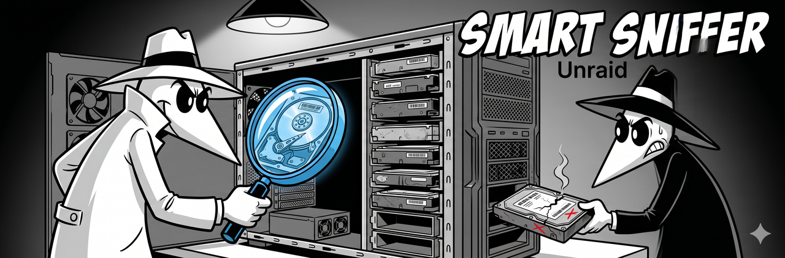

<p align="center">
  
</p>

# Unraid

> **This guide is a work in progress.** SMART Sniffer has not been extensively tested on Unraid. The information below is based on community reports and the platform's known characteristics. Contributions from Unraid users are very welcome -- see [Contributing](#contributing) below.

## What we know

Unraid uses its own storage management layer rather than traditional RAID or ZFS. Drives are presented individually to the OS, which is good news for SMART Sniffer -- `smartctl --scan` should find them normally.

Key platform details:

- **Network bridge:** Unraid uses `br0` as its main network bridge (similar to Proxmox's `vmbr0`). When installing the agent, select `br0` for the mDNS interface if prompted.
- **Docker-first ecosystem:** Unraid users typically run services as Docker containers. A community Docker image for the SMART Sniffer agent is available from [@fireinice](https://github.com/fireinice/docker-smart-sniffer) on [Docker Hub](https://hub.docker.com/r/fireinice/smart-sniffer).
- **Filesystem:** Unraid's array uses XFS or btrfs per-disk. The agent's filesystem monitoring should work, though this hasn't been confirmed on Unraid specifically.

## Installation options

### Option A: Native install (untested)

```bash
curl -sSL https://raw.githubusercontent.com/DAB-LABS/smart-sniffer/main/install.sh | sudo bash
```

The installer's `/opt` fallback path should work if Unraid restricts `/usr/local/bin`. This path hasn't been validated on Unraid -- please report your experience.

### Option B: Docker (community)

See the [Docker guide](docker.md) and the [community Docker image](https://github.com/fireinice/docker-smart-sniffer).

## Contributing

If you're running SMART Sniffer on Unraid, we'd love your help filling in this guide. Open a PR with your setup details, or drop your experience in a [GitHub issue](https://github.com/DAB-LABS/smart-sniffer/issues) and we'll incorporate it.

Things we'd like to know:

- Does the native installer work? What install path did it use?
- Does `smartctl --scan` find all drives (array + cache + parity)?
- Does the Docker image work with Unraid's Docker implementation?
- Any mDNS discovery issues with `br0`?
- Does filesystem monitoring report accurate usage for Unraid's per-disk XFS/btrfs?

## Related

- [Docker guide](docker.md) -- containerized agent deployment
- [Platform Install Paths](../platform-install-paths.md) -- where the installer puts things on different OSes
- [Main README](../../README.md) -- full feature list and roadmap
