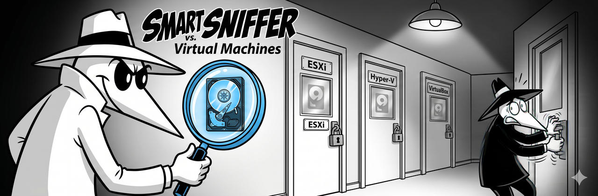

<p align="center">
  
</p>

# Virtual Machines (ESXi, Hyper-V, VirtualBox)

This guide covers the general pattern for running SMART Sniffer when Home Assistant is inside a virtual machine. If you're on Proxmox specifically, see the [Proxmox guide](proxmox.md) for more detailed steps.

## The rule

SMART data lives in the physical drive's firmware. Virtual disk controllers don't pass SMART commands through. This is true across all hypervisors:

| Hypervisor | Virtual disk controller | Passes SMART? |
|------------|------------------------|---------------|
| Proxmox / KVM | virtio-scsi, virtio-blk | No |
| VMware ESXi | PVSCSI, LSI Logic, SATA | No |
| Microsoft Hyper-V | Synthetic SCSI | No |
| Oracle VirtualBox | AHCI, virtio | No |

If you install the agent inside the VM, it will find the virtual disk, open it successfully, and then fail on every SMART query (exit code 4). The drive shows up as UNSUPPORTED.

## The pattern: agent on host, integration in VM

```
+---------------------------+       mDNS / TCP 9099       +------------------+
|     Hypervisor host       |  <------------------------  |     HA VM        |
|                           |                              |                  |
|  [SMART Sniffer Agent]    |  -- serves drive data -->   |  [Integration]   |
|  Reads physical drives    |                              |  Creates HA      |
|  via smartctl             |                              |  entities        |
+---------------------------+                              +------------------+
```

1. **Install the agent on the hypervisor host** where it has direct hardware access
2. **Install the integration in HA** (via HACS) -- the integration connects to the agent over the network
3. The agent advertises via mDNS and the integration discovers it, or you set it up manually

## VMware ESXi

ESXi doesn't run arbitrary Linux binaries on the host easily -- it's a purpose-built hypervisor with a locked-down userland. Options:

**Option A: Dedicated monitoring VM.** Create a small Linux VM (Debian, Ubuntu Server) and use PCI passthrough (DirectPath I/O) to pass the SATA/NVMe/HBA controller to that VM. Install the agent there. The agent has direct hardware access and advertises to your HA VM over the network.

**Option B: vSphere CLI + external monitoring.** ESXi includes `esxcli storage` and limited smartctl access via the ESXi shell. However, this doesn't integrate with the SMART Sniffer agent. For full integration, Option A is the way to go.

**Network note:** Make sure the monitoring VM and HA VM are on the same port group / VLAN for mDNS discovery to work. Or use manual integration setup.

## Microsoft Hyper-V

Hyper-V runs on Windows or Windows Server. Install the agent on the Windows host:

```powershell
# Download the Windows binary from GitHub Releases
# https://github.com/DAB-LABS/smart-sniffer/releases
```

The Windows agent uses the same smartctl backend. Make sure smartmontools is installed on the Windows host (available from the [smartmontools download page](https://www.smartmontools.org/wiki/Download)).

**Network note:** Hyper-V's default switch uses NAT, which blocks mDNS between host and guest. Use an external virtual switch (bridged to your physical NIC) so the HA VM and the host are on the same Layer 2 network. Or use manual integration setup.

## Oracle VirtualBox

VirtualBox is common for development and testing. Install the agent on the host OS (Linux, macOS, or Windows):

```bash
# Linux / macOS:
curl -sSL https://raw.githubusercontent.com/DAB-LABS/smart-sniffer/main/install.sh | sudo bash
```

**Network note:** VirtualBox defaults to NAT networking for VMs. Switch the HA VM's network adapter to **Bridged Adapter** so it's on the same network as the host. Otherwise, mDNS won't work and you'll need manual integration setup.

## PCI passthrough as an alternative

On any hypervisor that supports it, you can pass the physical SATA/NVMe/HBA controller directly to the HA VM (or a dedicated monitoring VM) via PCI passthrough (IOMMU / VT-d / DirectPath I/O). This gives the VM direct hardware access, and the agent runs inside the VM with full SMART visibility.

Trade-offs:

- The physical controller is tied to one VM -- no other VMs can use those drives
- More complex to set up (IOMMU groups, BIOS settings, controller compatibility)
- Not all controllers pass through cleanly

For most users, the agent-on-host pattern is simpler.

## Troubleshooting

### Auto-discovery not working

mDNS is link-local multicast. The host and the HA VM must be on the same Layer 2 network. Check:

- VM network adapter type (bridged, not NAT)
- VLAN tags match
- No firewall blocking UDP 5353 (mDNS) or TCP 9099 (agent API)

If mDNS won't work in your environment, manual setup always works: **Settings --> Devices & Services --> Add Integration --> SMART Sniffer** with the host's IP and port.

### I see a virtual disk as UNSUPPORTED

That's expected. The agent inside the VM found the virtual disk and correctly identified it as unsupported. Install the agent on the host instead.

## Related

- [Proxmox guide](proxmox.md) -- detailed Proxmox-specific steps
- [Main README](../../README.md) -- full feature list, entity reference, roadmap
